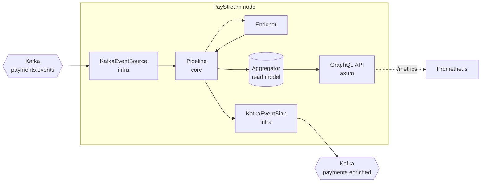
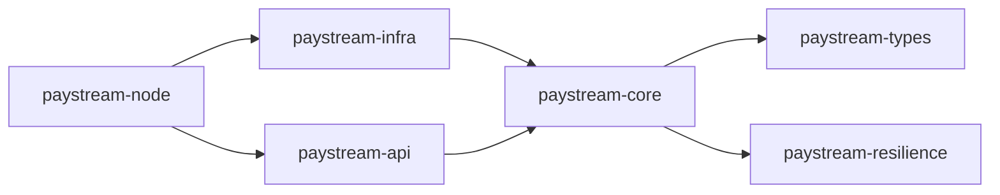
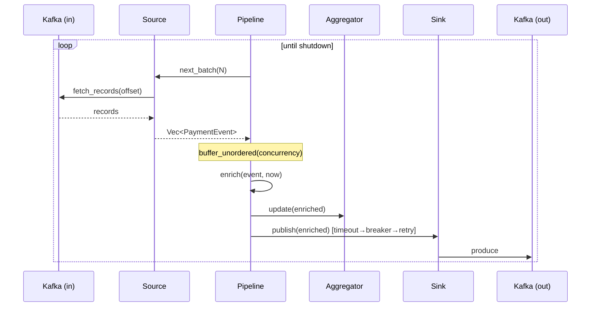

# PayStream

> A high-throughput **payment-event stream processor** on **real Apache Kafka** — consume payment lifecycle events, enrich them with a risk score, maintain real-time CQRS aggregates, and republish, all on an async Tokio pipeline with timeouts, retries, a circuit breaker and rate limiting.

[](https://github.com/ABHIJEET-MUNESHWAR/PayStream/actions/workflows/ci.yml)
[](https://www.rust-lang.org/)
[](https://kafka.apache.org/)
[](#-test-results)
[](#-quality-gates)
[](LICENSE)


---

## Table of Contents

1. [Why PayStream](#-why-paystream)
2. [Feature Highlights](#-feature-highlights)
3. [Architecture](#-architecture)
4. [The Pipeline](#-the-pipeline)
5. [Design Patterns & Principles](#-design-patterns--principles)
6. [Resilience](#-resilience)
7. [Observability](#-observability)
8. [GraphQL API](#-graphql-api)
9. [Kafka Client Choice](#-kafka-client-choice)
10. [Getting Started](#-getting-started)
11. [Test Results](#-test-results)
12. [Benchmarks & Complexity](#-benchmarks--complexity)
13. [Quality Gates](#-quality-gates)
14. [Project Structure](#-project-structure)
15. [Self-Evaluation](#-self-evaluation)

---

## 🎯 Why PayStream

Payment platforms emit a firehose of lifecycle events (initiated → settled → completed …). PayStream
turns that stream into value in real time: it **enriches** each event (risk score + ingest latency),
maintains a **live aggregate read model** (throughput, counts by status/direction, settled totals),
and **republishes** the enriched events for downstream consumers — on a fully async, back-pressured,
resilient Tokio pipeline reading from and writing to **real Apache Kafka**.

It is the streaming complement to the sibling services [NexusPay](../NexusPay) (orchestration) and
[ReconLedger](../ReconLedger) (ledger): PayStream consumes exactly the kind of events they emit.

## ✨ Feature Highlights

| Capability | How |
|---|---|
| Real Kafka I/O | `rskafka` pure-Rust protocol client behind swappable ports |
| Async pipeline | Tokio; per-event bounded concurrency (`buffer_unordered`) |
| Enrichment | Deterministic, explainable risk scoring (LLM-swappable) |
| Real-time CQRS read model | Thread-safe `Aggregator` snapshotted by GraphQL |
| Exact money | `i64` minor units; no floats on the money path |
| Resilience | timeout + retry(backoff) + circuit breaker + token-bucket rate limit |
| Back-pressure | batch fetch + bounded concurrency + idle backoff |
| GraphQL API | `async-graphql` over `axum` |
| Observability | Prometheus metrics + structured JSON `tracing` |
| Type-safety | newtypes, `#![forbid(unsafe_code)]`, sealed-ish enums |

---

## 🏗 Architecture



Hexagonal Cargo workspace — dependencies point inward:



### Component Responsibilities

| Crate | Responsibility |
|---|---|
| `paystream-types` | `Money`, `PaymentEvent`, `EnrichedPaymentEvent`, `AggregatesSnapshot`, errors |
| `paystream-resilience` | retry+backoff, circuit breaker, timeout, token-bucket rate limiter |
| `paystream-core` | ports (`EventSource`/`EventSink`), `enrich`, `Aggregator`, `Pipeline` |
| `paystream-infra` | rskafka source/sink, config, Prometheus metrics |
| `paystream-api` | async-graphql schema + axum router |
| `paystream-node` | composition root: wiring, tracing, graceful shutdown |

---

## 🔄 The Pipeline



Forward path per event: **enrich → aggregate → publish**. The publish is guarded by
`timeout(circuit_breaker(retry_with_backoff(...)))`; a persistently failing broker trips the breaker
and sheds load instead of blocking the batch.

---

## 🧩 Design Patterns & Principles

**SOLID** hexagon. Patterns: Ports & Adapters (Kafka behind `EventSource`/`EventSink`), Strategy
(pluggable resilience + risk scoring), Pipeline/Producer-Consumer, State (circuit breaker),
Newtype (`Money`), and generic combinators (`retry_with_backoff<F,Fut,T,E>`, `CircuitBreaker::call`).

Type-safety: `#![forbid(unsafe_code)]` in every crate; exact-integer `Money`; enums for `Direction`
/`PaymentStatus`; errors modelled with `thiserror`.

---

## 🛡 Resilience

| Concern | Mechanism |
|---|---|
| Slow broker | `with_timeout` per publish |
| Transient failures | `retry_with_backoff` (capped exponential) |
| Sustained failure | `CircuitBreaker` (Closed→Open→Half-Open) fails fast |
| Overload | `TokenBucket` rate limiter (deterministic, testable) |
| Back-pressure | batch fetch + `buffer_unordered` + idle backoff |
| Poison records | undecodable Kafka records are logged and skipped |

Every primitive is unit-tested, including circuit-breaker state transitions and retry exhaustion.

---

## 📈 Observability

- **Metrics** at `GET /metrics` (Prometheus): `paystream_events_consumed_total`,
  `paystream_events_published_total`, `paystream_events_publish_failed_total`.
- **Tracing**: structured JSON logs via `tracing` + `tracing-subscriber` (`RUST_LOG`-configurable).
- **Dashboards & alerts**: Grafana dashboard + Prometheus alerts (instance down, publish failures,
  consumer stalled) via Alertmanager. `docker compose up`.

---

## 🔌 GraphQL API

`POST /graphql` · GraphiQL at `/graphiql` (default port **8082**).

```graphql
query {
  health
  aggregates {
    totalProcessed
    maxRiskScore
    byStatus { status count }
    byDirection { direction count }
    settled { currency settledMinorUnits }
  }
}
```

Also `GET /health` and `GET /metrics`. Postman collection: [`postman/`](postman/PayStream.postman_collection.json).

---

## 🔧 Kafka Client Choice

PayStream uses **[`rskafka`](https://crates.io/crates/rskafka)** — a pure-Rust Apache Kafka
*protocol* client (used in production by InfluxDB IOx). It speaks the real Kafka wire protocol against
a real broker; there is no custom in-house pipeline. It was chosen over `rdkafka` because rdkafka
bundles the native `librdkafka` C library, which needs a full C toolchain (cmake + libcurl/openssl
headers) to build. Crucially, Kafka lives **behind the `EventSource`/`EventSink` ports**, so swapping
in an `rdkafka` adapter for production is a localized change with zero impact on the pipeline.

The real end-to-end Kafka round-trip test lives in
[`crates/infra/tests/kafka_it.rs`](crates/infra/tests/kafka_it.rs); it is `#[ignore]`d by default and
runs against a broker:

```bash
docker compose up -d kafka
PAYSTREAM_KAFKA=localhost:9092 cargo test -p paystream-infra -- --ignored
```

---

## 🚀 Getting Started

```bash
cargo test                       # 27 unit + integration tests (no broker needed)
cargo clippy --all-targets --all-features -- -D warnings
docker compose up --build        # Kafka + PayStream + Prometheus + Grafana (:3002)

# Feed the pipeline (from another shell):
docker compose exec kafka \
  kafka-console-producer.sh --bootstrap-server localhost:9092 --topic payments.events
# then paste a JSON event, e.g.:
# {"payment_id":"8f2c...","direction":"PAY_IN","account":"acct-1","amount":{"currency":"MXN","minor_units":100000},"status":"COMPLETED","occurred_at":"2026-07-12T10:00:00Z"}
```

---

## ✅ Test Results

`cargo test` — **27 passing, 1 ignored** (the ignored one needs a live broker). By crate:

| Crate | Coverage | Tests |
|---|---|---:|
| `paystream-types` | Money math, currency scales, event JSON round-trip | 7 |
| `paystream-resilience` | retry (success/exhaustion), breaker (open/half-open/reopen), timeout, token bucket | 9 |
| `paystream-core` | enrichment + aggregation (unit) | 6 |
| `paystream-core` | pipeline end-to-end with fakes (happy, retry, empty) | 3 |
| `paystream-api` | GraphQL `aggregates` query | 1 |
| `paystream-infra` | config defaults | 1 |
| `paystream-infra` | real Kafka round-trip | 1 (ignored) |
| **Total** | | **27 + 1** |

```
test result: ok. 7 passed   (types)
test result: ok. 9 passed   (resilience)
test result: ok. 6 passed   (core lib)
test result: ok. 3 passed   (core pipeline_test — enrich+aggregate+resilient publish)
test result: ok. 1 passed   (api graphql)
test result: ok. 1 passed; 1 ignored  (infra)
```

---

## 🏎 Benchmarks & Complexity

Criterion microbenchmarks ([`crates/core/benches`](crates/core/benches/pipeline_bench.rs)):

```bash
cargo bench -p paystream-core --bench pipeline_bench
```

| Benchmark | Time | Complexity |
|---|---|---|
| `enrich_single_event` | ≈ **19 ns** | O(1) |
| `aggregator_update` | ≈ **12.6 ns** | O(1) amortized |

| Operation | Time complexity |
|---|---|
| `enrich` | O(1) |
| `Aggregator::update` / `snapshot` | O(1) / O(k) distinct keys |
| `process_batch` | O(n) events, up to `concurrency` in flight |
| Kafka fetch/produce | O(batch) |

---

## 🔒 Quality Gates

```bash
cargo fmt --all -- --check
cargo clippy --all-targets --all-features -- -D warnings   # clean
cargo test
```

Every crate is `#![forbid(unsafe_code)]`. CI enforces fmt + clippy(-D warnings) + tests + Docker build.

---

## 📁 Project Structure

```
PayStream/
├── crates/
│   ├── types/        # Money, events, aggregates, errors
│   ├── resilience/   # retry, circuit breaker, timeout, rate limiter
│   ├── core/         # ports, enricher, aggregator, pipeline (+ benches)
│   ├── infra/        # rskafka source/sink, config, metrics
│   ├── api/          # async-graphql schema + axum router
│   └── node/         # composition root (main)
├── monitoring/       # Prometheus, Alertmanager, Grafana
├── postman/ · Dockerfile · docker-compose.yml · .github/workflows/ci.yml
└── EVALUATION.md
```

---

## 🔎 Self-Evaluation

See [EVALUATION.md](EVALUATION.md) for a candid review against the engineering standards.
